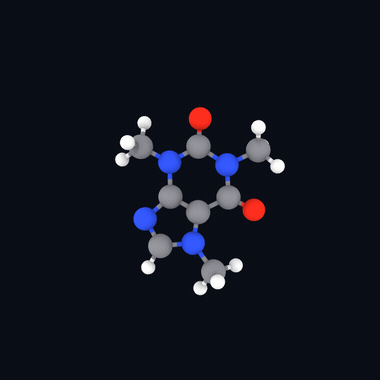

# TT-Atom



Run Meta's [UMA](https://huggingface.co/facebook/UMA) interatomic potential on [Tenstorrent](https://tenstorrent.com). Energy, forces and stress for molecules and periodic materials, behind an [ASE](https://wiki.fysik.dtu.dk/ase/) calculator. Bring your own UMA checkpoint.

## Install

```bash
pip install git+https://github.com/moritztng/tt-atom.git
```

You need a Tenstorrent card to run it.

## Quickstart

```bash
tt-atom run structure.xyz
```

```python
from ase.io import read
from tt_atom import UMA

atoms = read("structure.xyz")
atoms.calc = UMA(atoms)
atoms.get_potential_energy()
atoms.get_forces()
```

`UMA(atoms)` uses `uma-s-1`, infers the task (`omat` if the cell is periodic, else `omol`), and builds a device-resident model for that composition on first use. Later calls load it from cache. Everything downstream is plain ASE.

## Relax and MD

```bash
tt-atom run structure.xyz --relax --out relaxed.xyz
tt-atom run structure.xyz --md --steps 200 --temp 300
```

Add `--trace` (or `UMA(atoms, trace=True)`) to replay the captured device graph over the loop. About 2x on relax/MD, forces stay bit-identical.

## What it supports

- Models: `uma-s-1` (default), `uma-m-1p1`.
- Tasks: `omol`, `omat`, `oc20`, `odac`, `omc`.
- Systems: isolated molecules and periodic cells. Charge and spin via `UMA(atoms, charge=-1, spin=2)`.
- Properties: energy, conservative analytic forces, and stress, so variable-cell relaxation works (see [`examples/relax_cell.py`](examples/relax_cell.py)).

## Accuracy

Every task is checked on-device against the released `uma-s-1` checkpoint run through fairchem on the same structure.

| task | system | energy rel. err | force PCC | stress PCC |
|------|--------|----------------:|----------:|-----------:|
| omol | ethanol         | 2e-7 | 0.9996  |     |
| omat | bulk Si         | 3e-4 | 0.99999 | 0.99999 |
| oc20 | Cu(100) + H slab| 9e-5 | 1.0000  |     |
| odac | MgO framework   | 2e-4 | 0.99999 |     |
| omc  | solid CO2       | 8e-5 | 1.0000  |     |

`uma-m-1p1` matches too (ethanol: energy rel. err 2e-8, force PCC 0.9999). Dynamics are stable: NVE energy drift is about 1 meV/atom/ps. These numbers are from `ttnn` 0.68.0. Op numerics can shift slightly between `ttnn` versions, so confirm parity on the version you actually run:

Reproduce it yourself. Every bundle embeds the fairchem reference energy and forces from build time, so:

```bash
tt-atom verify model.npz     # device output vs the embedded fairchem reference
pytest tests/                # full parity suite against fairchem goldens
```

## Throughput

Batch independent systems into a single device pass:

```python
out = calc.evaluate_batch(list_of_atoms)   # out["energy"], out["forces"]
```

For many small molecules this is roughly 13x over looping on one card. To use several cards, fan systems across them with `tt_atom.batch` (one process per card).

## Compared to fairchem

TT-Atom is an inference runtime, not a rewrite of fairchem. It reuses the released weights and matches them.

|  | fairchem | TT-Atom |
|--|:--------:|:-------:|
| Hardware | GPU, CPU | Tenstorrent |
| Energy, forces, stress | ✅ | ✅ |
| Molecules, periodic (PBC) | ✅ | ✅ |
| Tasks (omol/omat/oc20/odac/omc) | ✅ | ✅ |
| Models | uma-s, uma-m, uma-l | uma-s-1, uma-m-1p1 |
| ASE relax and MD | ✅ | ✅ (plus a traced loop) |
| Batched inference | ✅ | ✅ (one composition per batch) |
| LAMMPS interface | ✅ | ❌ |
| Training, fine-tuning | ✅ | ❌ (inference only) |

## Bundles and the reference environment

The model is a "bundle": UMA weights merged for one composition. `UMA(atoms)` builds and caches bundles for you, so most users never touch this. To build one yourself:

```bash
tt-atom convert-checkpoint --uma-s-1 --xyz structure.xyz --task omol --out model.npz
```

then `TTAtomCalculator("model.npz")`.

Building a bundle needs `fairchem` to read the checkpoint and merge the experts. `fairchem` wants `numpy>=2`, which cannot share a process with `ttnn`'s `numpy<2`, so keep it in its own venv:

```bash
python -m venv refenv && refenv/bin/pip install "fairchem-core>=2.10"
```

`UMA(atoms)` and `tt-atom run` call it automatically the first time they see a new composition, then cache the result. Set `TT_ATOM_REFENV` to its python if it is not found automatically. Cached runs never need it.

## License

MIT for this code, which reimplements the UMA / eSCN-MD architecture from [fairchem](https://github.com/facebookresearch/fairchem) (also MIT). It depends on `ttnn` (Apache-2.0) and `ase` (LGPL-2.1+). The UMA weights are separately licensed under the [FAIR Chemistry License](https://huggingface.co/facebook/UMA), are gated, and are not included. Bring your own.
