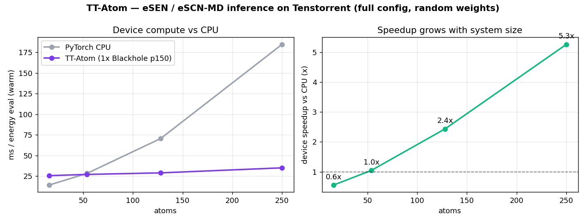
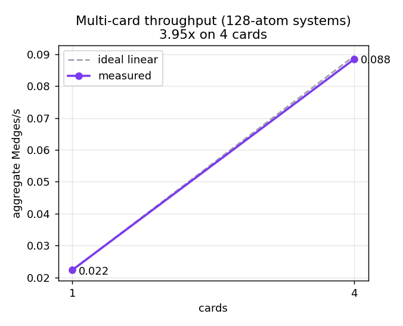

# TT-Atom

**High-performance [Tenstorrent](https://tenstorrent.com) inference for the eSEN / eSCN-MD
(Meta [UMA](https://huggingface.co/facebook/UMA)-family) equivariant ML interatomic potential.**

TT-Atom runs the eSCN-MD backbone — energy **and conservative analytic forces** — fully
device-resident on Tenstorrent via [`ttnn`](https://github.com/tenstorrent/tt-metal), behind a
clean [ASE](https://wiki.fysik.dtu.dk/ase/) `Calculator`. It is a focused inference engine, not
a framework: one architecture, done fast.



> Measured on a Blackhole **p150** card, full config (`sphere_channels=128, lmax=mmax=2,
> 2 layers`), vs 16-thread PyTorch CPU on the same machine. The TT per-eval latency is nearly
> flat in system size, so the speedup **grows with the system** — from ~parity at tens of
> atoms to **5.3× at 250 atoms**. All numbers in this README are real and reproducible with
> the scripts in [`benchmarks/`](benchmarks); nothing is hardcoded.

## Why it maps cleanly to Tenstorrent

eSCN/eSEN replaces the irregular Clebsch–Gordan tensor products of typical equivariant nets
with the **SO(2) convolution trick**: after rotating each edge into its local frame with a
Wigner-D matrix, the SO(3) tensor product collapses into a set of **per-order (per-`m`) dense
GEMMs**. ~85–90 % of the compute is then plain matmul/BMM — exactly what the hardware wants —
while the genuinely equivariant "hard part" (Wigner construction, radius graph) is <1 % of the
work and stays on host. TT-Atom is built around this:

- **`so2.py`** — the SO(2) convolution as flat per-`m` 2-D GEMMs in a tile-aligned
  `[E, 9·C]` layout (no spherical-dim tile padding).
- **`rotation.py`** — the per-edge Wigner rotation as a **sparse multiply-accumulate** over
  its fixed nonzero pattern (block-diagonal in degree), one launch over all edges — replacing
  a launch-bound batched `[E,9,9]×[E,9,C]` matmul.
- **`forces.py`** — **analytic** `F = −dE/dx` by a hand-written reverse pass through the device
  graph (matmul backward = transpose-matmul on device); the cheap geometric `d(Wigner)/dx`
  Jacobian is finished by `torch.autograd` on host. **Not finite differences.**
- **`model.py` / `device.py`** — full device residency, program cache, `bf16` weights with
  `HiFi4` + `fp32` dest accumulation + `packer_l1_acc` (matmul PCC ≈ 1.0 vs torch).
- **`batch.py`** — one-process-per-card fan-out for multi-card throughput.

## Accuracy status — please read

This repository is the **implementation**. It does **not** ship model weights: the
`facebook/UMA` checkpoints are gated under the FAIR Chemistry License — **bring your own**.

What is validated here is the **architecture and the numerics**, against a bit-exact PyTorch
reference, with **random weights** (an unconstrained but valid eSCN-MD model):

| quantity | result (random weights, vs fp32 PyTorch reference) |
|---|---|
| per-module PCC (SO(2), gate, RMS-norm-SH, grid, edgewise) | ≥ 0.99 |
| end-to-end energy, relative error | 1e-4 – 6e-3 (largest on the smallest systems) |
| analytic force PCC / cosine | **0.99996 / 0.99996** |
| force MAE | 4.0e-4 (\|F\|max 0.206) |

### Real-weight accuracy (uma-s-1)

Validated against the **released `facebook/UMA` uma-s-1 checkpoint** via the official fairchem
reference (single p150, ethanol / `omol` task; numbers measured on this card and reproducible with
`tests/test_realweight.py`):

| quantity | result (uma-s-1, vs fairchem oracle) |
|---|---|
| MoLE host-merge anchor (merged backbone vs unmerged-MoE oracle) | E rel **1.3e-12**, force **PCC 1.0** |
| spectral atomwise, per-module PCC | **0.99999** |
| end-to-end device energy, relative error | **1.8e-7** (−4218.471 eV vs −4218.472) |
| analytic force PCC / cosine | **0.99958 / 0.99958** |
| force MAE (\|F\|max 0.553, ref 0.560) | **3.4e-3** eV/Å |
| real-weight ASE FIRE relaxation (ethanol) | converged, fmax 9.16 → **0.049** eV/Å in 58 steps |

uma-s-1 uses a 32-expert MoLE backbone, a spectral feed-forward, and a `rand_emb` charge/spin/
dataset embedding; the released energy is `rmsd·E_raw + Σ element_refs[Z]`. TT-Atom merges the
experts to a plain `eSCNMDBackbone` **on host** (fairchem's own `merge_mole` path — a plain
backbone *is* the MoLE inference path for a fixed composition), runs the spectral FF and the SO(2)
chain device-resident, and applies the per-task normalizer on host. Loading is drop-in:
`tools/export_weights.py` reads a fairchem checkpoint into a `WeightBundle` and `weights.py`
verifies key/shape coverage. The UMA checkpoint is gated, so the real-weight tests auto-skip when
the bundle is absent. *(Perf and multi-card numbers below are unchanged and were measured
separately; real-weight validation here is single-p150 only.)*

## Performance (measured, p150 Blackhole, full config)

| atoms | edges | TT device (ms) | CPU 16-thr (ms) | **device speedup** | end-to-end speedup | Medges/s |
|------:|------:|---------------:|----------------:|-------------------:|-------------------:|---------:|
| 16  | 154  | 25.6 | 14.3 | 0.6× | 0.5× | 0.006 |
| 54  | 786  | 27.1 | 28.4 | 1.1× | 0.6× | 0.029 |
| 128 | 2234 | 29.0 | 70.6 | **2.4×** | 1.0× | 0.077 |
| 250 | 4834 | 35.1 | 184.7 | **5.3×** | 1.6× | 0.138 |

**Multi-card throughput** scales near-linearly — **3.95× on 4 cards** (128-atom systems,
program-cache-warm):



Honest notes:
- *End-to-end* includes the host geometry (Python/torch Wigner construction + graph) and the
  per-call upload; at small sizes that host work dominates, so end-to-end trails the raw device
  speedup. The device engine itself is the column that scales.
- **Trace capture** gives up to **2.9×** at small/medium sizes (dispatch-bound) and ~1× at
  large sizes (genuinely device/data-movement bound).
- A `--fast` (`bfloat8_b`) mode exists but gives **no speedup** here — the forward is
  data-movement bound, not flop bound — and slightly worse accuracy, so **`bf16` is the
  recommended default**.

## Quickstart

Two environments are required because `ttnn` needs `numpy<2` and `fairchem` needs `numpy>=2`:

```bash
# 1) runtime env (ttnn + TT-Atom)
pip install -e .                     # numpy<2, torch, ase, and ttnn (Tenstorrent wheel)

# 2) reference env (only to export weights / regenerate goldens)
pip install "fairchem-core>=2.10"    # numpy>=2 — keep this in a SEPARATE venv
```

Export a weight bundle (random demo, or your own checkpoint) **in the reference env**:

```bash
python tools/export_weights.py --out model.npz                       # random architecture demo
python tools/export_weights.py --checkpoint uma.pt --out model.npz   # real weights (BYO)
```

Run it through ASE **in the runtime env**:

```python
from ase.build import molecule
from ase.optimize import FIRE
from tt_atom import TTAtomCalculator

atoms = molecule("C2H6O")
atoms.calc = TTAtomCalculator("model.npz")     # device-resident eSCN-MD engine
FIRE(atoms).run(fmax=0.05)                      # analytic forces -> real relaxation on TT
print(atoms.get_potential_energy())
```

A complete relaxation is in [`examples/relax.py`](examples/relax.py) (converges on device).
Multi-card screening:

```python
from tt_atom import MultiCard
with MultiCard("model.npz", device_ids=[0, 1, 2, 3]) as mc:
    energies, _ = mc.energies(systems)          # fanned across all 4 cards
```

## Reproduce the numbers

```bash
python -m pytest tests/ -q                                       # 12 parity + force tests
python benchmarks/bench_throughput.py --weights model.npz --cells 2 3 4 5
python benchmarks/bench_multicard.py  --weights model.npz
python benchmarks/plot.py                                        # regenerate assets/*.png
```

## Layout

```
tt_atom/   model · so2 · rotation · forces · geometry · grid · norm · activation · weights · calculator · batch · device
tests/     PCC parity (per-module + end-to-end) · analytic-force VJP · ASE calculator
benchmarks/throughput (1-card sweep, CPU-vs-TT) · multi-card scaling · chart generator
examples/  ASE FIRE relaxation on device
tools/     fairchem checkpoint -> WeightBundle exporter
```

## License

TT-Atom (this code) is **Apache-2.0** (see [LICENSE](LICENSE), [NOTICE](NOTICE)). It depends on
`fairchem-core` for reference/weights but vendors none of it. The UMA / eSEN model weights are
**separately licensed** (FAIR Chemistry License) and are **not** included or redistributed here.
